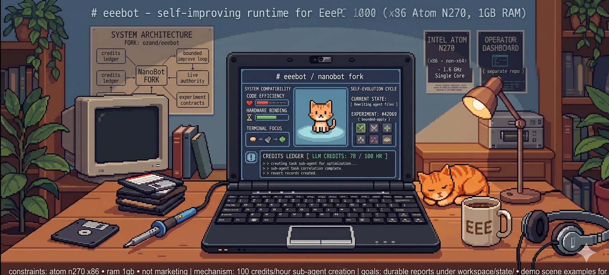

# eeebot

This repository is the canonical `eeebot` project for the eeepc self-improving runtime and its operator-facing control/dashboard workflow.

Important compatibility note:
- the repository/project name is now `eeebot`
- the internal Python package, CLI, and many runtime paths still use `nanobot` for compatibility with the existing deployed system, dashboard, and eeepc host
- the package now exposes both CLI entrypoints during the compatibility window:
  - `nanobot`
  - `eeebot`
- renaming the package/runtime internals should be treated as a separate migration, not mixed into the GitHub repo rename

It is not a plain mirror of the upstream `HKUDS/nanobot` repository.
It contains fork-specific work for:
- bounded self-improving runtime slices
- eeepc live authority integration
- HADI + WSJF hypothesis/prioritization surfaces
- experiment contracts, outcomes, frontier tracking, credits, and revert records
- local operator dashboard integration and proof-oriented docs

GitHub repositories:
- Canonical main project repo: https://github.com/ozand/eeebot
- Temporary/staging dashboard repo: https://github.com/ozand/eeebot-ops-dashboard
  - This sibling repo is not the durable source of truth for product work.
  - Dashboard/operator-control code should be imported or mirrored into `ozand/eeebot`; see `.legacy/docs/EEEBOT_CANONICAL_REPOSITORY_AND_DASHBOARD_CONSOLIDATION.md`.
- Upstream source project: https://github.com/HKUDS/nanobot

## What this fork is for

This fork is focused on making Nanobot operationally useful for a real bounded self-improvement loop on `eeepc`, not just preserving upstream defaults.

Key fork-specific capabilities include:
- live authority reads from eeepc control-plane state
- durable self-evolving cycle reports under `workspace/state/`
- approval-gated bounded apply behavior
- promotion/write-path/read-path convergence notes and proofs
- HADI hypothesis backlog with explicit WSJF surface
- experiment contracts with `keep` / `discard` / `crash` / `blocked`
- credits ledger and durable subagent/task correlation

## Canonical docs to start with

Top-level docs index:
- `docs/README.md`

End-to-end system reference (read this first):
- `docs/SYSTEM_OPERATION_REFERENCE.md` — roles, timers, coordinator cycle, artifacts, subagent bridge (cycle-branch → import-smoke → integrate-to-main), models, diagnostics
- `docs/OBSERVABILITY.md` — how to see what the system is doing
- `docs/ARCHITECTURE.md` — high-level map

Core operating docs:
- `docs/EEEBOT_SELF_IMPROVING_RUNTIME_OPERATING_CONTRACT.md`
- `docs/EEEBOT_INSIGHT_HYPOTHESIS_LOOP_CLOSURE.md`
- `docs/EEEBOT_BUDGET_AND_REWARD_MODEL.md`
- `docs/EEEBOT_EXPERIMENT_AND_OUTCOME_CONTRACT.md`
- `docs/EEEBOT_OPERATOR_WORKFLOW.md`

Capability specs (current product truth) live under `docs/specs/` — see `docs/specs/README.md`. Notably:
- `docs/specs/self-evolving-runtime/spec.md`, `docs/specs/subagent-bridge/spec.md`
- `docs/specs/promotion-and-release/spec.md`, `docs/specs/host-runtime/spec.md`
- `docs/specs/migration/spec.md` (nanobot → eeebot rename guardrails, in progress)

Host runbooks:
- `docs/EEEPC_DEPLOY_VERIFY_ROLLBACK_RUNBOOK.md`
- `docs/EEEPC_APPLY_OK_OPERATOR_RUNBOOK.md`

Tasks/backlog: **GitHub Project #7** + Issues (not a markdown file). See `AGENTS.md`.
Archived/superseded docs live in `.legacy/` (not current guidance).

## Upstream relationship

We still track upstream `HKUDS/nanobot`, but we do not blindly merge everything.

Merge policy for this fork:
- take safe, high-value upstream fixes selectively
- avoid merges that would break the eeepc 32-bit/runtime constraints
- preserve fork-specific bounded self-improvement behavior and operator surfaces

Examples of upstream updates that are good candidates:
- session durability and corruption repair
- safe subagent/session routing fixes
- narrowly-scoped agent reliability improvements

Examples that require extra scrutiny before merge:
- packaging/layout changes
- provider/model defaults
- heavy WebUI or channel changes
- features that assume environments unavailable on eeepc

## LiteLLM configuration — single source of truth

All LiteLLM credentials and routing settings for the eeepc runtime live in **one place**:

```
/etc/eeepc-agent/litellm.env
```

**Never set `LITELLM_API_KEY`, `LITELLM_BASE_URL`, or `LITELLM_MODEL` anywhere else.**

### File layout

| File | Role |
|------|---------|
| `/etc/eeepc-agent/litellm.env` | **Source of truth** — key, endpoint, model, timeouts |
| `/etc/eeepc-agent/models.yaml` | Allowed model registry (41 models, grouped by provider) |
| `/etc/eeepc-agent/instances/self-evolving-agent.env` | Agent-specific settings only (state dirs, sync flags) |
| `/etc/systemd/system/eeepc-self-evolving-agent.service.d/litellm-env.conf` | systemd drop-in that injects `litellm.env` into the service |
| `/home/opencode/.nanobot-eeepc/config.template.json` | Gateway wrapper template — reads key from same values |

### Key rotation procedure

```bash
# 1. Edit only litellm.env
sudo nano /etc/eeepc-agent/litellm.env

# 2. Restart the service — no other files need touching
sudo systemctl restart eeepc-self-evolving-agent.service

# 3. Verify
curl -s -o /dev/null -w "%{http_code}" \
  https://litellm.ayga.tech:9443/v1/models \
  -H "Authorization: Bearer <new-key>"
# expect: 200
```

### Current endpoint

| Field | Value |
|-------|-------|
| `LITELLM_BASE_URL` | `https://litellm.ayga.tech:9443/v1` |
| Key alias | `eeepc-20260320` |
| Key suffix | `049A` |
| Rotated | `2026-06-08T08:33:42Z` |
| `LITELLM_MODEL` | `cl/gpt-5.4-mini` |
| Code model | `cl/gemini-3.1-pro-preview` |
| General/Vision | `cl/gemini-3.5-flash` |

### Recommended cost-effective models

From `/etc/eeepc-agent/models.yaml` — all carry the `cl/` or `an/` prefix required by the gateway:

- **Mini / default**: `cl/gpt-5.4-mini`
- **Code / reasoning**: `cl/gemini-3.1-pro-preview`
- **General / vision**: `cl/gemini-3.5-flash`
- **Flash (cheap)**: `cl/gemini-2.5-flash-lite`

Avoid `cl/gpt-5.5` and `cl/claude-opus-*` for routine cycles — cost is disproportionate.

## Current state

This repo should be understood as:
- a maintained operational eeebot repository
- still carrying `nanobot` compatibility internally in code/runtime names
- not a vanilla upstream checkout
- not a marketing landing page

## Local repo-side self-improving cycle

The local repo-side workspace runtime can be driven by the user systemd timer:
- `systemd/eeebot-local-cycle.service`
- `systemd/eeebot-local-cycle.timer`

Install locally with:
- `./scripts/install_user_units.sh`
- create `~/.config/eeebot-self-improving.env`
- `systemctl --user enable --now eeebot-local-cycle.timer`

Recommended env values:
- `NANOBOT_WORKSPACE=/home/ozand/herkoot/Projects/nanobot/workspace`
- `NANOBOT_RUNTIME_STATE_SOURCE=workspace_state`
- optional `NANOBOT_SELF_EVOLVING_TASKS=...`
- optional `NANOBOT_LOCAL_APPROVAL_TTL_SECONDS=900`
- optional `NANOBOT_RUNTIME_ROOT=/home/ozand/herkoot/Projects/nanobot/workspace/state/self_evolution/runtime/current`

The local approval keeper is also available:
- `systemd/eeebot-local-approval-keeper.service`
- `systemd/eeebot-local-approval-keeper.timer`

The guarded self-evolution loop is the default managed autonomous path on this host:
- `systemd/eeebot-guarded-evolution.service`
- `systemd/eeebot-guarded-evolution.timer`
- `scripts/create_candidate_release.py`
- `scripts/health_check_release.py`
- `scripts/guarded_self_evolve.py`
- `scripts/commit_and_push_self_evolution.py`

This guarded path creates a self-mutation request, commits/pushes tracked source changes, creates a candidate release from the current git commit, applies it through a release directory/current symlink, runs an automatic health gate, and writes rollback/failure-learning artifacts if the gate fails.

Recommended guarded-evolution env values:
- `NANOBOT_AUTOEVO_WAIT_SECONDS=300`
- `NANOBOT_AUTOEVO_MAX_REPORT_AGE_SECONDS=600`
- `NANOBOT_REPO_ROOT=/home/ozand/herkoot/Projects/nanobot`
- `NANOBOT_WORKSPACE=/home/ozand/herkoot/Projects/nanobot/workspace`
- `NANOBOT_AUTOEVO_REMOTE_NAME=selfevo` (recommended publish target for separate self-evolving host repo)
- `NANOBOT_AUTOEVO_REMOTE_BRANCH=main`
- `NANOBOT_AUTOEVO_SOURCE_REMOTE_NAME=origin`
- `NANOBOT_AUTOEVO_SOURCE_REMOTE_BRANCH=main`
- `NANOBOT_AUTOEVO_ALLOWED_REPO=ozand/eeebot-self-evolving`
- optional `NANOBOT_SELFEVO_GITHUB_TOKEN=...` for a dedicated repo-scoped publish credential
- optional `NANOBOT_RUNTIME_ROOT=/home/ozand/herkoot/Projects/nanobot/workspace/state/self_evolution/runtime/current/source`
- `NANOBOT_INSTALL_GUARDED_EVOLUTION=1` during install to enable the guarded timer automatically

This is intentionally local-only for the repo-side workspace runtime on this host.
It should not be confused with the operator-controlled eeepc live approval workflow.

For current runtime and dashboard state, see the fork docs and the separate dashboard repo.
