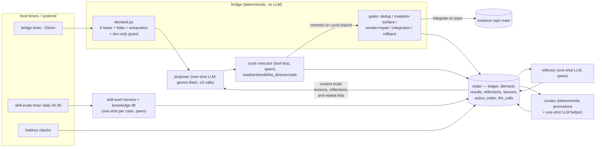
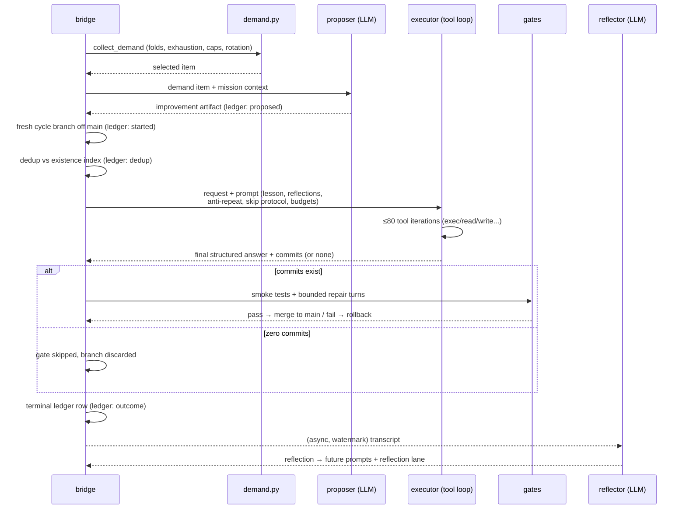
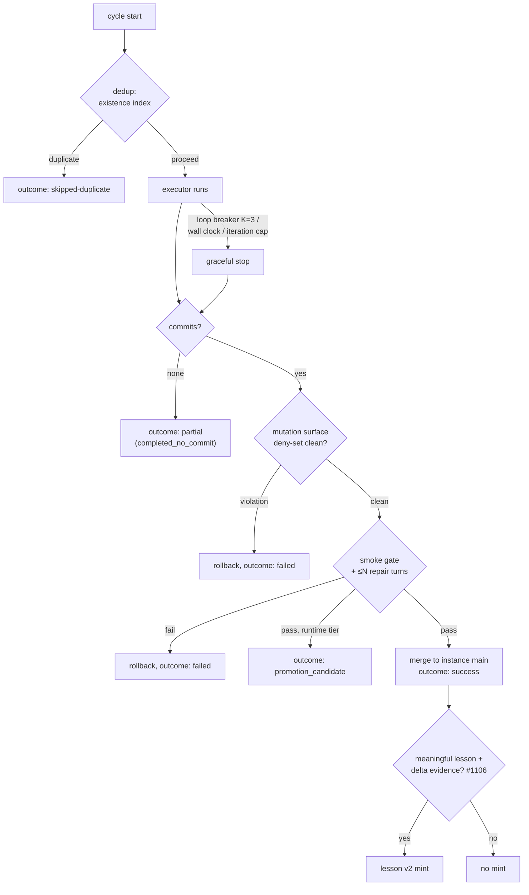

# ADR-001: Agent architecture — roles, tools, models, and budgets

This is a retrospective ("as-built") ADR: it records the agent architecture that is
already implemented and deployed, so that future decisions can be made against an
explicit, verifiable baseline. All file/line references are as of product commit
`d4b4ed87`. Line numbers drift; the named symbols do not.

## Status

Accepted. Describes the production system running on host `eeepc` (bridge cadence
~20 min, verified live 2026-08-30/31).

## Context

eeebot is a bounded self-improving runtime split across three repositories:

- **product** (`ozand/eeebot`) — the immutable-per-release runtime code (`nanobot/`),
  deployed to the host as versioned releases;
- **instance** (`ozand/eeebot-self-evolving`) — the live workspace the system is
  allowed to mutate (scripts, skills, lessons, state);
- **host** — systemd units, env files, and timers on `eeepc` that schedule everything.

The central design tension: the system must be able to *change itself* (instance
repo) without being able to *break its own safety machinery* (product code, gates,
fitness inputs). The architecture resolves this by concentrating all
world-mutating capability in exactly one agent (the cycle executor) behind
deterministic gates, while every other LLM use is a tool-less text-to-text call
whose only influence on the world is mediated through state files and future
prompts.

## Decision

### D1. Agent taxonomy

Four classes, by decreasing capability:

| Class | Components | LLM loop | Tools |
|---|---|---|---|
| **Tool-loop agents** | cycle executor (bridge subagent); nanobot main agent (chat framework mode) | multi-turn tool-calling loop | filesystem + exec (+ web; main agent also messaging/spawn/cron/MCP) |
| **One-shot LLM calls** | proposer, reflector, knowledge curator helper, knowledge lift, skill-eval harness | single completion (proposer: ≤3) | none |
| **Forced-single-tool calls** | heartbeat, evaluator, memory consolidator | single completion, output constrained to one synthetic tool schema | the schema tool only (structured output, no side effects) |
| **No-LLM machinery** | demand collection, dedup/mutation-surface/smoke gates, integration, rollback, held-out checkers, goal review text machinery, curator promotions | none | deterministic code |

### D2. Tool-loop agents

**Cycle executor** — the only agent that can mutate the instance repo.
Constructed per cycle in `nanobot/agent/subagent.py` (`ToolRegistry` build at
`subagent.py:239-272`):

| Tool | Impl | Constraints |
|---|---|---|
| `read_file` | `agent/tools/filesystem.py` | locked to workspace (`allowed_dir`) + built-in skills dir; `SKILL.md` reads instrumented for skill fitness (#939) |
| `write_file` | filesystem.py | workspace-locked |
| `edit_file` | filesystem.py | workspace-locked |
| `list_dir` | filesystem.py | workspace-locked |
| `exec` | `agent/tools/shell.py` | default timeout 60 s, hard cap 600 s per call; cwd = workspace |
| `web_search` | `agent/tools/web.py` | config-gated |
| `web_fetch` | `agent/tools/web.py` | proxy-aware |

Deliberately **absent**: `message`, `spawn`, `cron`, MCP — the executor cannot
talk to users, schedule work, or spawn further agents. There is no dedicated
grep/git tool; all repo interrogation and commits go through `exec`
(observed in production action traces as `exec:git-*`, `exec:python3`).

Loop guards (all in `subagent.py`):
- iteration cap: default 15, bridge resolves per profile via
  `resolve_max_tool_iterations` (#578/#906) — production `bounded_execution`
  cycles run with 80;
- wall-clock soft deadline: `NANOBOT_SUBAGENT_WALL_SECS`, default 3000 s (#1101);
- identical-tool-call loop breaker: `NANOBOT_LOOP_BREAKER_K`, default 3
  consecutive identical calls → graceful stop, `stop_reason=identical_call_loop`
  (#1101).

**nanobot main agent** (`agent/loop.py:125-144`) — the chat-framework mode of the
same codebase; not part of the self-improvement loop on the host. Same seven
tools as the executor plus `message` (outbound bus), `spawn` (SubagentManager),
`cron` (if a cron service is wired), and MCP tools when servers are configured.
`exec` is config-disableable here (`exec_config.enable`).

### D3. One-shot LLM components (no tools)

| Component | Call site | Shape | Notes |
|---|---|---|---|
| **Proposer** | `runtime/llm_proposer.py` (completion at `:1665-1708`) | ≤3 chat completions per pass (`_MAX_LLM_CALLS`) | turns one demand item into a bounded improvement artifact |
| **Reflector** | `runtime/reflector.py` | one completion per unprocessed cycle, watermark-gated | reads cycle transcript, writes `reflections.jsonl` (findings, recommendations, mermaid) |
| **Knowledge curator (helper)** | `runtime/knowledge_curator.py:587-602` | one completion, `max_tokens=1200`, `temperature=0.2` | promotions themselves are deterministic (evidence via action index, #1094/#1107) |
| **Knowledge lift** | `runtime/knowledge_lift.py:193` | direct completion | A/B lift measurement over the knowledge corpus |
| **Skill-eval harness** | `runtime/skill_eval_harness.py:297-330` | one completion per case (with/without skill), grading is mechanical assertions | warmup call excluded from timing; `finish_reason` recorded per row (#1104) |

These components cannot act. Their entire effect on the system is the text they
persist to state files, which later cycles read.

### D4. Model routing

All calls go through the LiteLLM gateway on the host. Per-role resolution in
`runtime/model_registry.py` (`resolve_model`): explicit arg → role env var(s) →
`SUBAGENT_BRIDGE_MODEL`-style fallbacks → built-in default.

| Role | Env (first match wins) | Production model (observed) |
|---|---|---|
| executor | `SUBAGENT_BRIDGE_MODEL` | `openai/un/qwen3.8-27b-gguf` (local, RTX 3090 Ti) |
| proposer | `SELFEVO_PROPOSER_MODEL`, `SUBAGENT_BRIDGE_MODEL` | `an/gemini-3.7-flash-high` (cloud, cheap/fast) |
| harness | `SELFEVO_HARNESS_MODEL`, `SUBAGENT_BRIDGE_MODEL` | qwen (deliberately NOT overridden: lift must be measured on the production executor model) |
| reflector | `SELFEVO_REFLECTOR_MODEL`, `SELFEVO_SUMMARY_MODEL` | qwen |
| curator | `SELFEVO_CURATOR_MODEL`, `SELFEVO_SUMMARY_MODEL` | qwen |

Sizing policy (operator decision, 2026-08-30): never starve the local model —
`max_tokens` 8192 for eval-style calls, thinking budgets preserved, generous
timeouts; anti-repetition is handled server-side plus `finish_reason` telemetry,
not by clamping tokens.

### D5. Budgets and limits (env-tunable)

| Limit | Default | Production override | Where |
|---|---|---|---|
| Executor iterations | 15 | 80 (bounded_execution) | `subagent.py:145`, resolved by bridge |
| Executor wall clock | 3000 s | — | `NANOBOT_SUBAGENT_WALL_SECS` |
| Loop breaker K | 3 | — | `NANOBOT_LOOP_BREAKER_K` |
| `exec` per-call timeout | 60 s (cap 600 s) | — | `shell.py` |
| Harness case timeout | 30 s | 300 s | `SELFEVO_HARNESS_CASE_TIMEOUT_S` (#1104) |
| Harness run budget | 240 s | 1800 s | `SELFEVO_HARNESS_RUN_BUDGET_S` |
| Harness total budget | 600 s | 3600 s | `SELFEVO_HARNESS_TOTAL_BUDGET_S` |
| Harness max_tokens | 8192 | 8192 | `SELFEVO_HARNESS_MAX_TOKENS` |
| Skill-eval weekly cap | 10 runs / rolling 7 days | — | `MAX_WEEKLY_RUNS`, `skill_eval_harness.py` |
| Demand exhaustion | 2 no-ops / 24 h per item | — | `_EXHAUSTION_REJECTS`, `demand.py` (#771/#1114) |
| Doc-only integrations | 5 / rolling 24 h | — | `doc_only_budget_24h`, `demand.py` (#1090/#1108) |
| Proposer LLM calls | 3 per pass | — | `_MAX_LLM_CALLS`, `llm_proposer.py` |

### D6. Component map

The state directory is the only interface between LLM components; no LLM output
reaches another LLM except through a persisted, schema-checked state file.

### D7. Cycle sequence (ledger phases)

### D8. Gate / fork tree per cycle

Dormant global switches, outside the per-cycle tree: operator kill switches
(#941/#1093), `bridge_busy` politeness skips for the eval timers, watermarks
(reflector, skill evals, knowledge lift), and the approval gate
(`approvals/apply.ok` → auto vs strict mode).

## Consequences

**Positive**
- Single mutating agent behind deterministic gates: a compromised or
  hallucinating one-shot component can at worst write misleading text into
  state; it cannot commit, push, or execute anything.
- Every LLM interaction is logged (`state/llm_calls/` + prompt dumps) and every
  executor action is compressed into `state/action_index/` — cycles are fully
  reconstructable after the fact.
- Budgets are env-tunable without releases (#1104), so latency/capacity tuning
  of the local model never requires code changes.

**Negative / accepted risks**
- `exec` is intentionally broad (git, python, arbitrary shell within the
  workspace); safety relies on the gate stack plus host privilege separation
  (dedicated `eeepc-agent` user), not on tool-level allowlists.
- One-shot components influence future behavior only through prompts, so
  prompt-assembly bugs are invisible until traced end-to-end (see the lesson
  citation channel: models cite `[Lesson …]` but `record_citations` receives
  proposer-artifact fields that never contain the executor text — known gap).
- Terminal outcome vocabulary is coarse: deliberate "already done" skips and
  explored-but-not-implemented cycles both land as `partial` (known gap).

## Alternatives considered

- **External CLI executor (pi-dev)** — removed in change 641; an in-process
  bounded tool loop is observable, budget-enforceable, and testable in ways an
  external interactive CLI is not.
- **MCP tools for the executor** — rejected in change 643 in favor of a minimal
  in-tree tool harness; MCP remains available only to the chat-framework mode.
- **Giving analysis components tools** (reflector/curator with repo access) —
  rejected: it would multiply the mutating surface for marginal benefit; the
  ledger/transcripts they need are already persisted as text.
- **Single monolithic agent** (one LLM does propose+execute+reflect) — rejected
  by the ledger-loop decision (change 702): separating proposal, execution, and
  reflection makes each step cheap to gate, replay, and attribute.

## References

- `nanobot/agent/subagent.py`, `nanobot/agent/loop.py`,
  `nanobot/agent/tools/{filesystem,shell,web,message,spawn,cron,mcp}.py`
- `nanobot/runtime/{bridge,demand,llm_proposer,reflector,knowledge_curator,knowledge_lift,skill_eval_harness,model_registry,lesson_v2}.py`
- docs/changes/641, 643, 672, 702, 760, 780, 789
- Issues: #1101 (loop breaker), #1104 (harness budgets), #1108 (doc-only guard),
  #1114 (zombie-priority fold/exhaustion)
